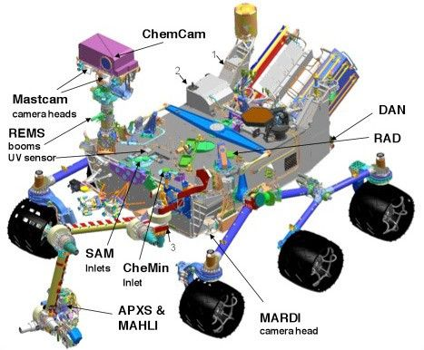

# Curiosity: Science Instruments

Curiosity carries ten science instruments distributed across its mast, arm, and body.

*Figure: The locations of Curiosity's ten science instruments.*

## Remote sensing (mast)

- **Mastcam** — a pair of color cameras for imaging terrain and targets.
- **ChemCam** — fires a laser to vaporize rock from a distance and reads the spark's spectrum to identify chemistry.

## Arm-mounted

- **MAHLI** — the Mars Hand Lens Imager, for extreme close-ups.
- **APXS** — an alpha-particle X-ray spectrometer for elemental composition.

## Analytical labs (body)

- **CheMin** — identifies minerals by X-ray diffraction.
- **SAM** — Sample Analysis at Mars, a suite that detects organic compounds and analyzes gases.

## Environment and descent

- **RAD** (radiation), **DAN** (subsurface hydrogen/water), **REMS** (weather), and **MARDI** (descent imager).
