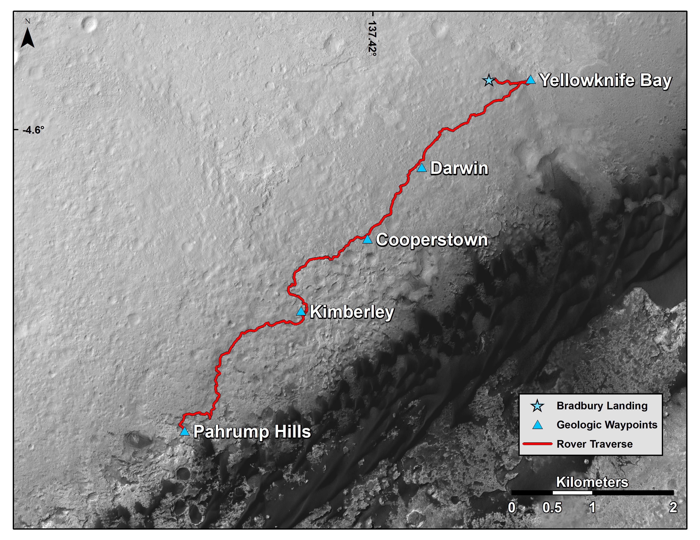

# Curiosity: Route up Mount Sharp

Curiosity touched down at Bradbury Landing on the floor of Gale Crater in August 2012. After studying the plains — including the habitability discovery at Yellowknife Bay — it drove toward Mount Sharp, reaching the "Pahrump Hills" outcrop at the mountain's base.

*Figure: Curiosity's route from landing to the base of Mount Sharp.*

It entered the mountain through a gap in the dark dune fields at "Murray Buttes" and has been ascending the layered slopes ever since, climbing through progressively younger rock. NASA builds these route maps from HiRISE images taken by the Mars Reconnaissance Orbiter, with each waypoint labeled by the sol on which the rover arrived.
