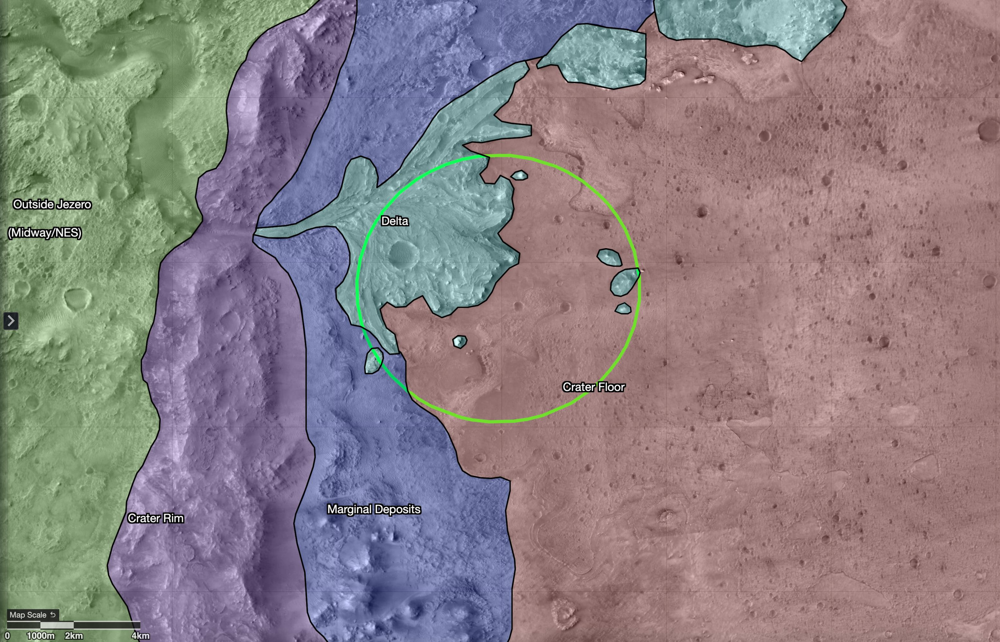

# Perseverance: Jezero Crater and Sample Caching

## Why Jezero

Perseverance explores Jezero Crater, a roughly 45-kilometer-wide basin that billions of years ago held a lake fed by a river. The river built a fan-shaped delta whose clays and carbonates are good at preserving signs of ancient life, which makes the crater a prime astrobiology target.

*Figure: Map of regions in and around Jezero Crater.*

## Sample caching

Perseverance drills rock cores and seals them in titanium tubes. In January 2023 it built the first sample depot on another world, at a site called "Three Forks," depositing ten tubes — including one atmospheric sample and one witness tube — in a carefully mapped zigzag pattern, each 5 to 15 meters apart. The depot is a backup set for the NASA–ESA Mars Sample Return campaign, which aims to bring Martian samples to Earth for study.
