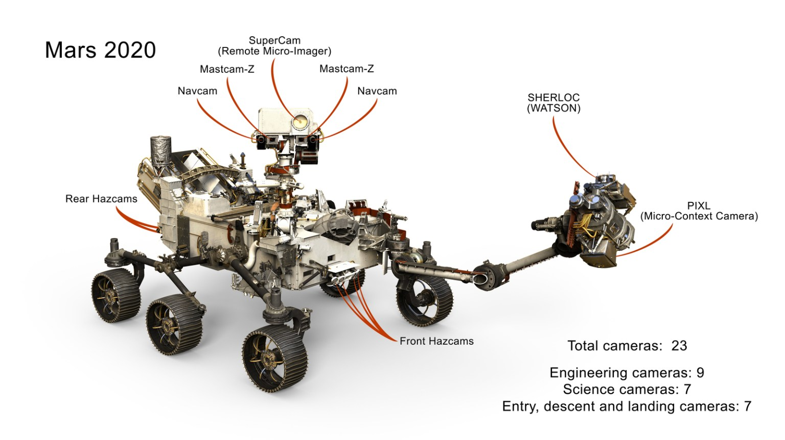

# Perseverance: Vehicle Specifications

## Size and mass

Perseverance is about 3 meters long (10 feet, not counting the robotic arm), 2.7 meters wide (9 feet), and 2.2 meters tall (7 feet). Its robotic arm reaches about 2.1 meters (7 feet). The rover weighs 1,025 kilograms (2,260 pounds) on Earth, including a 45-kilogram (99-pound) sampling turret. It uses the same basic chassis design as Curiosity but is heavier and carries more capable sampling hardware.

## Cameras

*Figure: The cameras of the Mars 2020 mission, labeled by location.*

The Mars 2020 mission flew 25 cameras to Mars — the most ever sent on a deep-space mission. The Perseverance rover itself carries 19 of them: nine engineering cameras, three entry-descent-and-landing cameras, and seven science cameras, including the Mastcam-Z zoomable stereo pair and SuperCam's remote imager.

## Wheels and power

Perseverance rolls on six aluminum wheels, each driven by its own motor. Each wheel has 48 treads — twice as many as Curiosity's — and skin twice as thick, for better durability on sharp Martian rocks. The rover is powered by a Multi-Mission Radioisotope Thermoelectric Generator (MMRTG).
