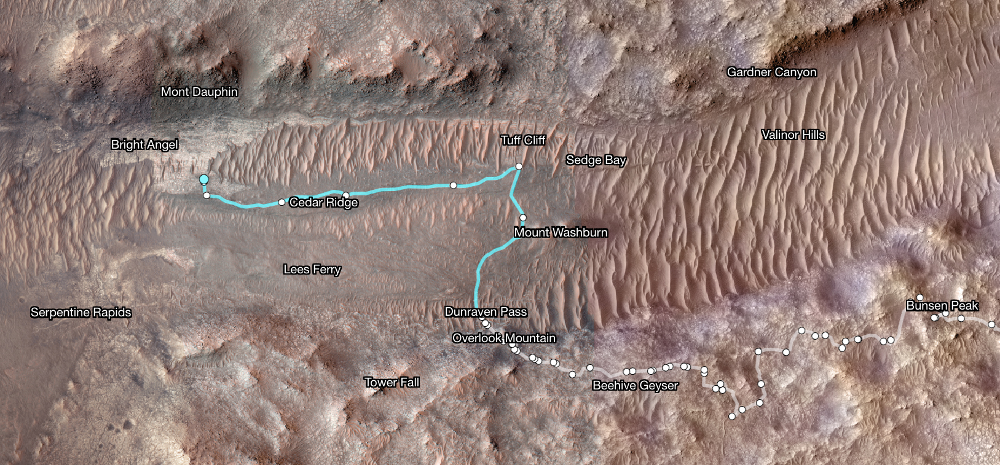

# Perseverance: Route and Current Location

From its landing site on the floor of Jezero Crater, Perseverance drove to the base of the ancient river delta, then climbed up and across the delta toward possible shoreline deposits. After exploring the delta it began climbing the crater rim, which rises about 610 meters (2,000 feet) above the floor, to reach the plains beyond.

*Figure: Perseverance's path toward the "Bright Angel" area.*

In 2024 the rover followed the Neretva Vallis river channel to a light-toned region the science team named "Bright Angel." On NASA's interactive route maps, each dot marks the end of a drive and is labeled with the Martian day, or sol, on which the rover stopped; the base map comes from the HiRISE camera on the Mars Reconnaissance Orbiter.
